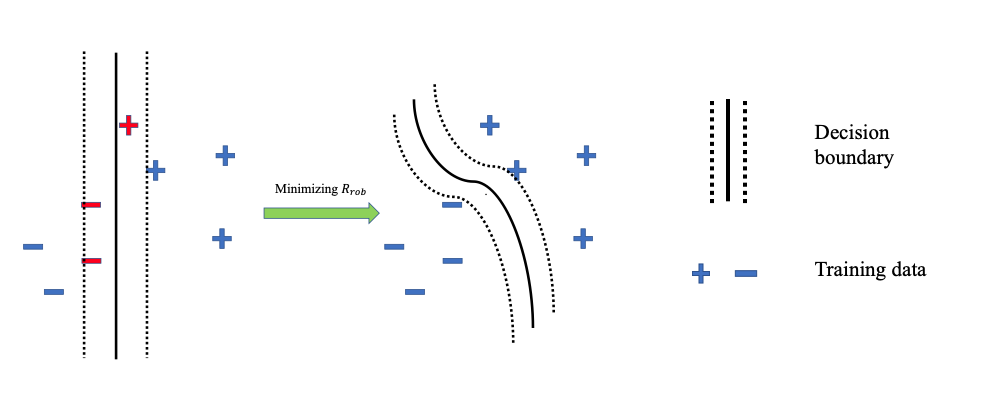
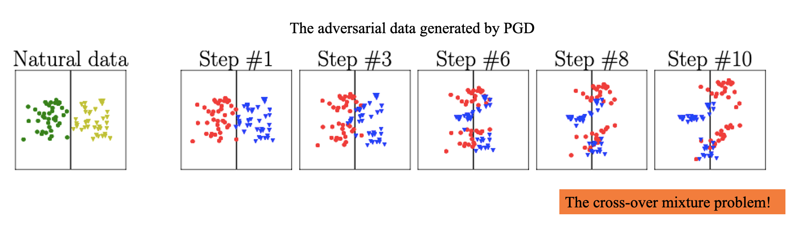
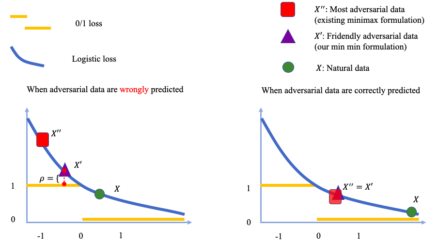
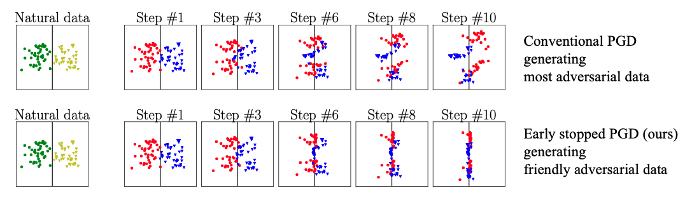

# Friendly Adversarial Training Code

This repository provides codes for friendly adversarial training (FAT). 

ICML 2020 Paper: **Attacks Which Do Not Kill Training Make Adversarial Learning Stronger** (https://arxiv.org/abs/2002.11242)
*Jingfeng Zhang\*, Xilie Xu\*, Bo Han, Gang Niu, Lizhen Cui, Masashi Sugiyama and Mohan Kankanhalli*

## What is the nature of the adversarial training?
Adversarial data can easily fool the standard trained classifier. 
Adversarial training employs the adversarial data into the training process. 
Adversarial training aims to achieve two purposes (a) correctly classify the data, and (b) make the decision boundary thick so that no data fall inside the decision boundary. 
<p align="center">
    
</p>
<p align="center">
The purposes of the adversarial training
</p>


## Conventional formulation of the adversarial training

Conventional adversarial training is based on the minimax formulation:

,y_i),)

where

,y_i).) 

Inside, there is maximization where we find **the most adversarial data**. Outside, there is minimization where we find a classifier to fit those generated adversarial data. 

### The minimax formulation is pessimistic.

The minimax-based adversarial training causes the severe degradation of the natural generalization.  Why? 
The minimax-based adversarial training has a severe cross-over mixture problem: the adversarial data of different classes overshoot into the peer areas. Learning from those adversarial data is very difficult. 
<p align="center">
    
</p>
<p align="center">
Cross-over mixture problem of the minimax-based adversarial training
</p>
  
## Our **min-min formulation** for the adversarial training. 

The outer minimization keeps the same. Instead of generating adversarial data via the inner maximization, we generate **the friendly adversarial data** minimizing the loss value. There are two constraints (a) the adversarial data is misclassified, and (b) the wrong prediction of the adversarial data is better than the desired prediction by at least a margin 

,y_i)\quad\mathrm{s.t.}\quad\ell(f(\tilde{x}),y_i)-\min_{y\in\mathcal{Y}}\ell(f(\tilde{x}),y)\ge\rho)


Let us look at comparisons between minimax formulation and min-min formulation.
<p align="center">
    
</p>
<p align="center">
Comparisons between minimax formulation and min-min formulation
</p>

## A Realization of the Min-min Formulation ---  Friendly Adversarial Training (FAT)

Friendly adversarial training (FAT) employs the friendly adversarial data generated by **early stopped PGD** to update the model.
The early stopped PGD stop the PGD interations once the adversarial data is misclassified. (Controlled by the hyperparameter ```tau```  in the code. Noted that when ```tau``` equal to maximum perturbation step ```num_steps```, our FAT makes the conventional adversarial training e.g., [AT](https://arxiv.org/abs/1706.06083), [TRADES](https://arxiv.org/abs/1901.08573), and [MART](https://openreview.net/forum?id=rklOg6EFwS) as our special cases.)
<p align="center">
    
</p>
<p align="center">
Conventional adversarial training employs PGD for searching most adversarial data. Friendly adversarial training employs early stopped PGD for searching friendly adversarial data.
</p>

## Preferred Prerequisites

* Python (3.6)
* Pytorch (1.2.0)
* CUDA
* numpy


## Running FAT, FAT for TRADES, FAT for MART on benchmark datasets  (CIFAR-10 and SVHN)

Here are examples: 
* Train WRN-32-10 model on CIFAR-10 and compare our results with [AT](https://arxiv.org/abs/1706.06083), [CAT](https://arxiv.org/abs/1805.04807) and [DAT](http://proceedings.mlr.press/v97/wang19i/wang19i.pdf):
```bash
CUDA_VISIBLE_DEVICES='0' python FAT.py --epsilon 0.031
CUDA_VISIBLE_DEVICES='0' python FAT.py --epsilon 0.062
```
### White-box evaluations on WRN-32-10

| Defense              	| Natural Acc. 	| FGSM Acc. | PGD-20 Acc. | C&W Acc. |
|-----------------------|-----------------------|------------------|-----------------|-----------------|
|[AT(Madry)](https://arxiv.org/abs/1706.06083)		| 87.30%	|  56.10%	|     45.80%	    | 46.80%
| [CAT](https://arxiv.org/abs/1805.04807)   		|  77.43%   	|   57.17%   		|     46.06%    	| 42.28%
| [DAT](http://proceedings.mlr.press/v97/wang19i/wang19i.pdf)  		|  85.03%  	|     63.53%      |     48.70%     | 47.27%
| FAT () |  **89.34**0.221%   	|65.520.355%| 46.130.049%| 46.820.517%
| FAT ()  | 87.000.203%| **65.94**0.244%|**49.86**0.328%|**48.65**0.176%

Results of AT(Madry), CAT and DAT are reported in [DAT](http://proceedings.mlr.press/v97/wang19i/wang19i.pdf). FAT has the same evaluations.

* Train WRN-34-10 model on CIFAR-10 and compare our results with [TRADES](https://arxiv.org/abs/1901.08573), and [MART](https://openreview.net/forum?id=rklOg6EFwS).
```bash
CUDA_VISIBLE_DEVICES='0' python FAT_for_TRADES.py --epsilon 0.031
CUDA_VISIBLE_DEVICES='0' python FAT_for_TRADES.py --epsilon 0.062
CUDA_VISIBLE_DEVICES='0' python FAT_for_MART.py --epsilon 0.031
CUDA_VISIBLE_DEVICES='0' python FAT_for_MART.py --epsilon 0.062
```

### White-box evaluations on WRN-34-10

| Defense              	| Natural Acc. 	| FGSM Acc. | PGD-20 Acc. | C&W Acc. |
|-----------------------|-----------------------|------------------|-----------------|-----------------|
|[TRADES](https://arxiv.org/abs/1901.08573)()| 88.64%	|  56.38%	|     49.14%	    | -
|FAT for TRADES()| **89.94**0.303% |61.000.418% |49.700.653%|49.350.363% 
|[TRADES](https://arxiv.org/abs/1901.08573)()|84.92%|61.06%|56.61%|**54.47**%
|FAT for TRADES()| 86.600.548% |**61.79**0.570% |55.980.209%|54.290.173% 
|FAT for TRADES()| 84.390.030% |61.730.131% |**57.12**0.233%|54.360.177% 

Results of TRADES ( and ) are reported in [TRADES](https://arxiv.org/abs/1901.08573). FAT for TRADES has the same evaluations. Noted that our evaluations of the above are the same as the description in the TRADES's paper, i.e., adversarial data are generated without random start ```rand_init=False```. 
However, in [TRADES’s GitHub](https://github.com/yaodongyu/TRADES), they use random start ```rand_init=True``` before PGD perturbation that is deviated from the statements in their paper. For the fair evaluations of FAT with random start, please refer to the Table 3 in [our paper](https://arxiv.org/pdf/2002.11242.pdf).

### How to recover original AT, TRADES, or MART? 
Just set ```tau=10```, i.e., 
```
python FAT.py --epsilon 0.031 --tau 10 --dynamictau False
python FAT_for_TRADES --epsilon 0.031 --tau 10 --dynamictau False
python FAT_for_MART.py --epsilon 0.031 --tau 10 --dynamictau False
```


## Want to attack FAT? Sure!

We welcome various attack methods to attack our defense models. For cifar-10 dataset, we normalize all images into ```[0,1]```. 

Download our pretrained models into the folder ```FAT_models``` through this [Google Drive link](https://drive.google.com/drive/folders/1lV3qob_zR-YpFVGuKiiE5hNu74NID-ZS?usp=sharing) or [Baidu Drive link](https://pan.baidu.com/s/17XBd02FoGFqgYCVy2Fm_SQ)(extraction code: ww7f).
```bash
cd Friendly-Adversarial-Training
mkdir FAT_models
```
Run robustness evaluations. 
```bash
chmod +x attack_test.sh
./attack_test.sh
```

## Reference

```
@inproceedings{zhang2020fat,
title={Attacks Which Do Not Kill Training Make Adversarial Learning Stronger},
author={Zhang, Jingfeng and Xu, Xilie and Han, Bo and Niu, Gang and Cui, Lizhen and Sugiyama, Masashi and Kankanhalli, Mohan},
booktitle = {ICML},
year={2020}
}
```

## Contact

Please contact jingfeng.zhang@auckland.ac.nz (preferred) OR jingfeng.zhang9660@gmail.com and xuxilie@mail.sdu.edu.cn if you have any question on the codes.
