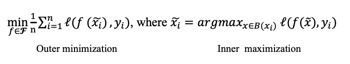
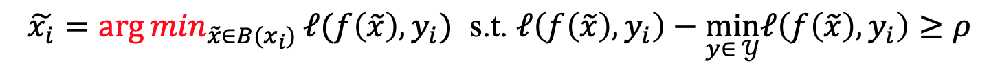

# Friendly Adversarial Training Code

This repository provides codes for friendly adversarial training (FAT). 

ICML 2020 Paper: **Attacks Which Do Not Kill Training Make Adversarial Learning Stronger** (https://arxiv.org/abs/2002.11242)
*Jingfeng Zhang\*, Xilie Xu\*, Bo Han, Gang Niu, Lizhen Cui, Masashi Sugiyama and Mohan Kankanhalli*

## What is the nature of the adversarial training?
Adversarial data can easily fool the standard trained classifier. 
Adversarial training employs the adversarial data into the training process. 
Adversarial training aims to achieve two purposes (a) correctly classify the data, and (b) make the decision boundary thick so that no data fall inside the decision boundary. 
<p align="center">
    
</p>
<p align="center">
<b>The purposes of the adversarial training
</p>

Conventional adversarial training is based on the minimax formulation. Inside, there is maximization where we find **the most adversarial data**. Outside, there is minimization where we find a classifier to fit those generated adversarial data. 
<p align="center">
    
</p>
<p align="center">
<b>The minimax formulation for adversarial training
</p>


The minimax formulation is pessimistic. The minimax-based adversarial training causes the severe degradation of the natural generalization.  Why? 
The minimax-based adversarial training has a severe cross-over mixture problem: the adversarial data of different classes overshoot into the peer areas. Learning from those adversarial data is very difficult. 
<p align="center">
    
</p>
<p align="center">
<b>Cross-over mixture problem of the minimax-based adversarial training
</p>
  
Our **min-min formulation** for the adversarial training. 
The outer minimization keeps the same. Instead of generating adversarial data via the inner maximization, we generate **the friendly adversarial data** minimizing the loss value. There are two constraints (a) the adversarial data is misclassified, and (b) the wrong prediction of the adversarial data is better than the desired prediction by at least a margin 
<p align="center">
    
</p>
<p align="center">
<b>Our proposed min-min formulation for the adversarial training
</p>

Let us look at comparisons between minimax formulation and min-min formulation.
<p align="center">
    
</p>
<p align="center">
<b>Comparisons between minimax formulation and min-min formulation
</p>

### Friendly Adversarial Training - A Realization of the Min-min Formulation
Friendly adversarial training (FAT) employs the friendly adversarial data generated by **early stopped PGD** to update the model.
The early stopped PGD stop the PGD interations once the adversarial data is misclassified. (Controlled by the hyperparameter ```tau```  in the code)
<p align="center">
    
</p>
<p align="center">
<b> Friendly adversarial training employs early stopped PGD for searching adversarial data.
</p>

## Prerequisites
* Python (3.6)
* Pytorch (1.2.0)
* CUDA
* numpy

## Running FAT, FAT for TRADES, FAT for MART on benchmark datasets  (CIFAR-10 and SVHN)
Here are examples: 
```bash
CUDA_VISIBLE_DEVICES=0 python FAT.py --epsilon 0.031
CUDA_VISIBLE_DEVICES=0 python FAT.py --epsilon 0.062
CUDA_VISIBLE_DEVICES=0 python FAT_for_TRADES.py --epsilon 0.031
CUDA_VISIBLE_DEVICES=0 python FAT_for_TRADES.py --epsilon 0.062
CUDA_VISIBLE_DEVICES=0 python FAT_for_MART.py --epsilon 0.031
CUDA_VISIBLE_DEVICES=0 python FAT_for_MART.py --epsilon 0.062
```

## Reference
```
@article{zhang2020fat,
  title={Attacks Which Do Not Kill Training Make Adversarial Learning Stronger},
  author={Zhang, Jingfeng and Xu, Xilie and Han, Bo and Niu, Gang and Cui, Lizhen and Sugiyama, Masashi and Kankanhalli, Mohan},
  journal={arXiv preprint arXiv:2002.11242},
  year={2020}
}
```
## Contact
Please contact j-zhang@comp.nus.edu.sg and 201700301039@mail.sdu.edu.cn if you have any question on the codes.
